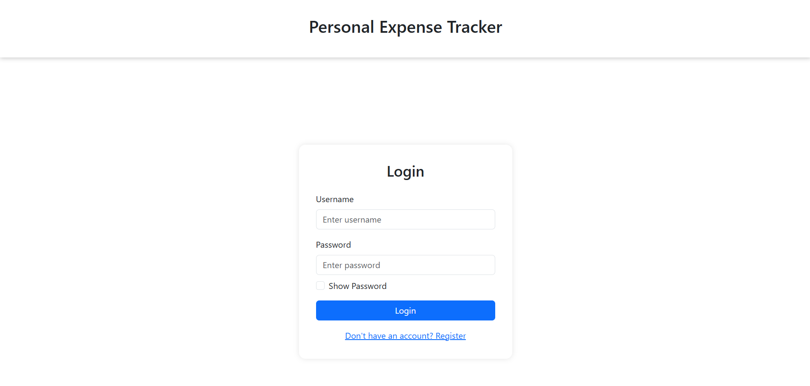
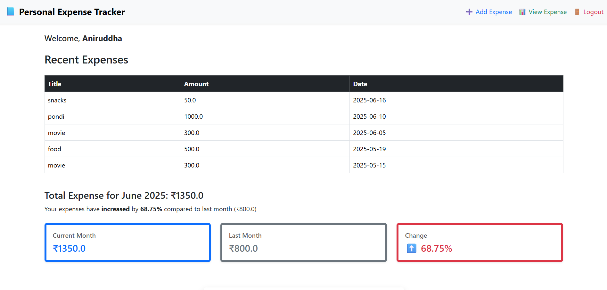
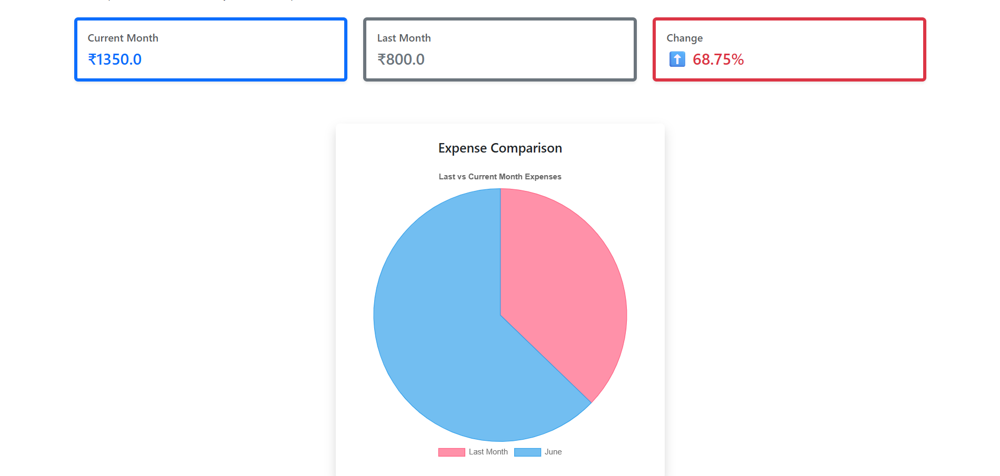
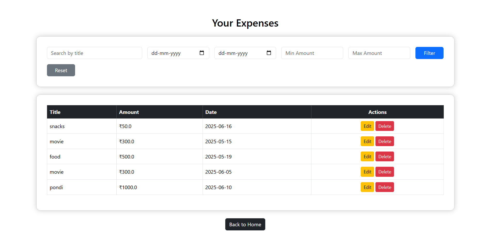

# 💸 Personal Expense Tracker

A clean, responsive, and feature-rich web application to help users keep track of their daily expenses, view detailed summaries, and compare spending patterns month-over-month. This project is built using **Flask** (Python) for the backend, **Bootstrap 5** for the frontend, and **Chart.js** for visual analytics.

---

## 🌟 Key Highlights

✅ User authentication with session management  
✅ Add, view, edit, and delete expense records  
✅ Advanced filtering (by date, amount, title)  
✅ Responsive dashboard with real-time flash messages  
✅ Summary card with monthly totals and percentage comparison  
✅ Pie chart visualizing monthly changes using Chart.js  
✅ Clean, modular design with Bootstrap layout  
✅ Secure `.env` handling for secret keys  
✅ Mobile-friendly & responsive UI

---

## 📷 Screenshots

Here are a few glimpses of the app:

- **Login Page**
  

- **Dashboard with Summary and Pie Chart**
  
  

- **View and Filter Expenses**
  

## 🧰 Built With

| Technology     | Description                         |
|----------------|-------------------------------------|
| Flask (Python) | Lightweight WSGI web framework      |
| SQLite         | Simple file-based relational DB     |
| HTML/CSS       | Markup and styling                  |
| Bootstrap 5    | Responsive front-end UI framework   |
| Chart.js       | Interactive pie chart for expenses  |
| Jinja2         | Flask templating engine             |
| JavaScript     | For dynamic client-side behavior    |

---

## 🧪 Features in Detail

### 🔐 Authentication
- Register a new account with secure password storage
- Login/logout functionality with session control
- Flash messages for invalid credentials or actions

### 🧾 Expense Management
- Add an expense with:
  - Title
  - Amount
  - Date
- View all expenses in a tabular format
- Edit and delete individual records with confirmation modals
- Filter expenses using:
  - Date range
  - Minimum and maximum amount
  - Expense title

### 📊 Dashboard & Charts
- View a summary of current month's total expense
- Compare with previous month’s spending
- View visual pie chart to understand % change
- Dashboard updates dynamically

### 📄 Responsive Design
- Works on both desktop and mobile devices
- Utilizes Bootstrap grid system for layout
- Consistent color theme with soft shadows and highlights

---

## 📁 Project Structure

personal-expense-tracker/
│
├── templates/ # Jinja2 HTML templates
│ ├── login.html
│ ├── register.html
│ ├── home.html
│ ├── add_expense.html
│ ├── edit_expense.html
│ └── view_expense.html
│
├── static/ # Optional: Custom CSS or JS
│ └── style.css # (if used)
│
├── app.py # Flask app with routes & logic
├── .gitignore # Prevents sensitive files from pushing
| |___.env # Secret key for Flask sessions  
├── requirements.txt # Python package dependencies
└── README.md # This file

✅ Best Practices Followed
-> Secure credential handling using .env

-> Clean and semantic HTML structure

-> Modular and reusable layout using Bootstrap

-> Flash messages for better UX

-> Minimal external JS/CSS dependencies

🎯 Future Improvements
-> Category-wise spending breakdown

-> Export expenses to CSV or PDF

-> Daily/monthly budget setting and alerts

-> Dark mode toggle

-> Integration with email for reports/reminders

📝 License
This project is open-source and available under the MIT License. Feel free to use, modify, or enhance it for personal or educational use.

🙋‍♂️ Author
Aniruddha
3rd Year B.Tech IT Student
📌 [GitHub](https://github.com/Aniruddha1026) | [LinkedIn](https://linkedin.com/in/aniruddha-anand)
